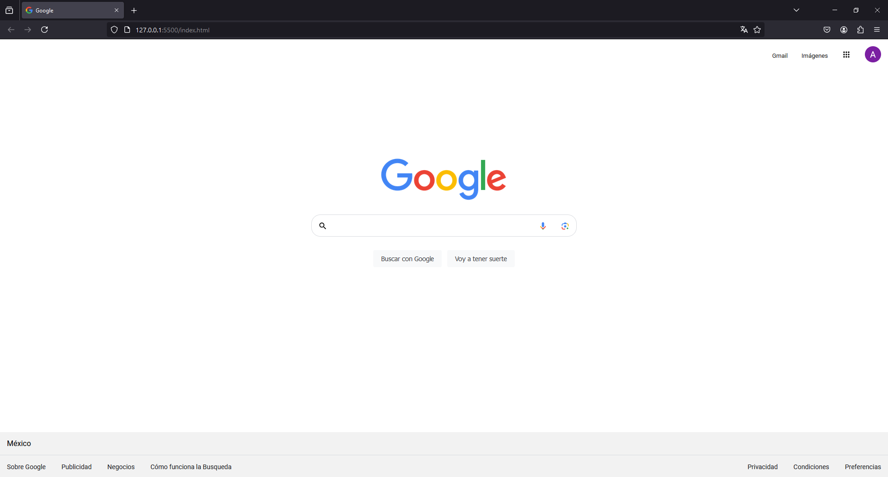

# Google Clone

This project is a static web page that mimics the look and feel of the Google search homepage. It is created for practice purposes to improve skills in HTML and CSS.

## Deployment

This project is deployed on Vercel. You can view the live version of the Google Clone [here.](https://google-clone-omega-five.vercel.app/)

## Screenshots

## Authors

- [@ArelyAyalaR](https://github.com/ArelyAyalaR)